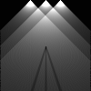

Efficient Raycasting for 2d Tilemaps
====================================

Java implemetation of the approximate ray/beam casting algorithm
for a discrete 2D tilemaps.

WUT?
----

For a square 2D map that consists of tiles (NxN tiles), where
each tile can be either empty, or contain light source or obstacle,
this algorithm calculates approximate brightness of each tile,
taking into account positions of the light sources
and occlusion from the obstacles.

(image was generated with `LightingTest`)

See also:
---------

* [JS demo](https://s3-us-west-1.amazonaws.com/plumbus.project/demo/2d-raycasting/index.html)
* [More detailed description](https://github.com/CleverRaven/Cataclysm-DDA/issues/23996#issue-331403618) by Kevin Granade

Properties
----------

If the input field is NxN tiles:

* worst case `O(N³)` (for the number of light sources between N and N²)
* best case is `O(N²)` (for constant number of light sources)
* CPU cache friednly (all data structures are accessed sequentially)

Why?
----

Naive ray/shadowcasting implementation is `O(N⁴)` in worst case
(`O(N²)` for each of `O(N²)` light sources).
This algorithm is  `O(N³)` worst case  (and it really matters when N >= 100).

Performance
-----------

See [benchmarks](benchmarks.md).

Building and Running
--------------------

Maven is used for building. Java 17 or newer is a prerequisite.

* Build and run tests: `./mvnw clean install`
* Run benchmarks after build: `java -jar target/benchmarks.jar`
* For specific benchmarks: `java -jar target/benchmarks.jar [benchmark class name]` (e.g., `java -jar target/benchmarks.jar LightingBenchmark`)

Project Structure
-----------------

* [Lighting.java](src/main/java/com/aivean/raycasting2d/Lighting.java)
    Class that implements the lighting calculation
* [LightingBenchmark.java](src/main/java/com/aivean/raycasting2d/LightingBenchmark.java)
    JMH benchmark for lighting
* [Rotation.java](src/main/java/com/aivean/raycasting2d/Rotation.java)
    Utility class for matrix rotations
* [RotationBenchmark.java](src/main/java/com/aivean/raycasting2d/RotationBenchmark.java)
    Rotations benchmark
* [LightingTest.java](src/test/java/com/aivean/raycasting2d/LightingTest.java)
    Simple unit test for lighting.
    Additionally generates PNG with the results.

License
-------

Copyright © 2018 [Ivan Zaitsev](https://github.com/Aivean/) (https://github.com/Aivean/efficient-2d-raycasting)

